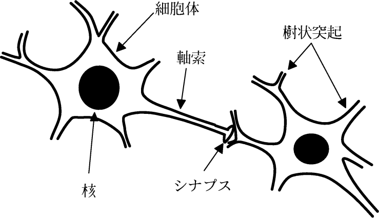
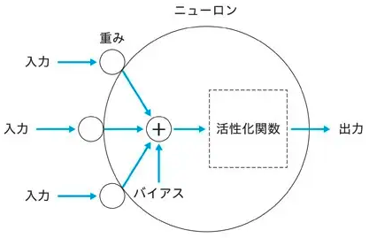
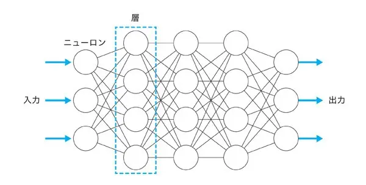
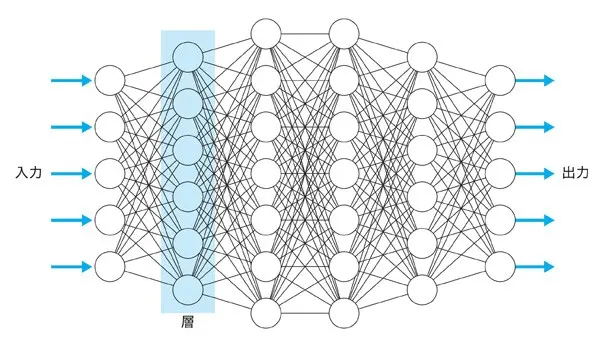

# 脳神経とNNの関係

## ニューロンとシナプス

### ニューロン
神経細胞（ニューロン）は、動物の神経系を構成する細胞であり、情報の伝達と処理の役割を担っております。
神経細胞は大きく分けて1.細胞体、2.樹状突起、3.軸索の3つの要素により構成されております。

### 細胞体
細胞体は神経細胞の中心であり、細胞核を包含しております。神経細胞の活動に必要な物質を合成し、供給いたします。

### 樹状突起
細胞体の表面にある数十の突起を樹状突起と申し上げます。

### 軸索
細胞体から長く伸びた1本の突起が軸索であります。軸索は途中で10ないし数百程度に分枝し、その先端は多数の細胞体や樹状突起と接続しております。

ある神経細胞の軸索の先端と、他のある神経細胞の細胞体ないし樹状突起とが接続している際、その接続部分をシナプスと呼び、軸索側の細胞をシナプス前細胞、細胞体ないし樹状突起側の細胞をシナプス後細胞と称します。



## ニューラルネットワーク(NN)とは
神経細胞ネットワークをモデルにした、コンピュータ上のネットワークを用いたAIをニューラルネットワークと呼びます。

### 人口ニューロン
神経細胞が持つ様々な機能の中から本質を見極めて、可能な限り本質を損なわないこと、そして可能な限りシンプルにした人工ニューロンは下図のようにモデル化されます。



ニューロンには複数の入力がありますが、出力は1つだけです。これは、樹状突起への入力が複数あるのに対して、軸索からの出力が1つだけであることに対応します。

　各入力には、重みを掛け合わせます。重みは結合荷重とも呼ばれ、入力ごとに値が異なります。この重みの値が脳のシナプスにおける伝達効率に相当し、値が大きければそれだけ多くの情報が流れることになります。

　そして、重みとバイアスを掛け合わせた値の総和に、バイアスと呼ばれる定数を足します。バイアスは言わば、ニューロンの感度を表します。バイアスの大小により、ニューロンの興奮しやすさが調整されます。

　入力と重みの積の総和にバイアスを足した値は、活性化関数と呼ばれる関数で処理されます。この関数は、入力をニューロンの興奮状態を表す信号に変換します。

## ニューラルネットワーク(NN)
人工ニューロンをつなぎ合わせて構築されたネットワークが、人工ニューラルネットワークです。

以下にニューラルネットワークの一例を示します。



## ディープラーニング(ディープニューラルネットワーク：DNN)
多数の層からなるニューラルネットワークです。近年の著しいAIの進化（物体認識やLLM）はDNNを用いた技術です。
一般的にニューロンが多ければ多いほど性能が優れています。性能の高いDNNにするためには、重みを適切に調整する必要があります。



# 子供の成長と脳神経
ニューロンが多く、適切な重みのDNNが優れていると言えます。
人の脳に置き換えると、神経細胞が多く、適切な神経回路の脳が優れていると言うことになります。

## 参考図書
様々な書籍は検討した。著者に脳神経科学の知見があり、子供の脳の成長をテーマにしている書籍を選定した。
こどもの「こころと脳」を科学する
著書　脳神経学者　山口和彦

### 著者経歴
東京大学理学部生物学科卒業。
東大理学系大学院、医学系大学院修了（脳神経生理学）。理学・医学博士。アメリカで博士研究員を務め帰国したのち、国立生理学研究所、杏林大学医学部、理化学研究所脳神経科学研究センターを経て、国立精神・神経センター客員研究員。東京女子大学元非常勤講師。

## 神経細胞
```いちばん左が妊娠三六週、左からふたつめが生まれたところです。生まれたあと、細胞の数は増えません。脳神経系の発生はお母さんのアルコール摂取や喫煙の影響を受けやすいことで知られています。```
つまり、脳神経細胞を増やすために必要なことはアルコール摂取や喫煙をしないことのみになります。

## 神経回路

### ２〜３歳までは神経細胞が密になる
```神経細胞の枝ぶりがよくなると、軸索も分かれて、神経細胞同士のつながり（神経回路）が２〜３歳までは、すごい勢いで密になっていきます。赤ちゃんが生まれてから、にっこりするようになったり、首が座ったり、成長していくあいだに、神経回路がどんどんできていきます。```
DNNに置き換えると、０歳では重みが全て０、２〜３歳まで全ての重みに値が入った状態である。
DNNの初期値は偏りがないことが良いとされています。
人の入力は五感であるため、様々な景色を見たり、色んな種類の絵本を読み聞かせることが大切だと考えられます。

### 3歳以降は必要なものだけを残す「刈り込み」が行われる
```ところが、そのまま大人になっていくかというと、そうではありません。これは最近わかったことなのですが、成長した神経細胞の枝（状突起）は、三、四歳を過ぎると、植木の枝が刈り込まれるように減っていきます。```

```二、三歳まではともかくいろいろな刺激によって神経細胞の枝ぶりが発達していきますが、このとき、使われなかったシナプスや電線、枝は刈り込まれてしまうと想像されています。たとえば日本語で生活する環境で育てば、中国語や英語、フランス語などにある子音は周囲から聞こえてきませんから、その音に対応する聴覚系のシナプス、電線、枝は消えてしまうのではないか、と想像されています。つまり、その人が生きる環境に必要なものだけが残り、必要のないシナプスや枝は刈り込まれてしまう、という仮説です。```

```それから「軸索 ＝電線」には、脳のなかで帰電や混線が起きないように脂質でできた被ふくが電気コードのビニールのようにぐるぐると巻きついています。これは生まれてすぐは巻きついていないのですが、成長の過程でだんだんと巻きついていき、二五〜三〇歳くらいに完成するといわれています。```

DNNに置き換えると、適切に重みを設定することです。これにより優れた性能に調整されます。
この重み設定で大切なことは過学習を起こさせないことです。
過学習は、学習時のデータに対してはよい精度を出すが、未知データに対しては同様の精度を出せないモデルが構築されてしまうことです。
過学習を避けるためには、Dropoutを設けたり、学習の順番をランダムにしたり、誤ったデータを与えたりします。
スポーツに当てはめると、一時期競技から離れたり、別の競技を行ったり、様々なコーチから教わることだと考えます。

### 考える力はどう育つ
```こどもは三、四歳ぐらいになったころから、「なぜ？」という言葉をいやというほど言い出します。この「なぜ？」を誰かに質問したりしながら、自分でも「どうしてだろう」と考えはじめます。これは人間だけがもつものですが、この「なぜ」と自発的に考えることをしないと、問題発見能力が伸びません。自分で「なぜ？」と問いを発し、その答えを見つけて喜びを感じる。このことをくり返しながら問いと答えが次第に深化していくことこそが、知的な発達のなかで最も重要なプロセスだと私は思っています。```

```三、四歳における文字の読み書き（リテラシー）の習得には家庭の経済による格差が見られましたが、これは収入の多い家庭のこどもほど、幼児教育を受ける機会が多いためと考えられます。しかしこの格差は五歳では見られなくなるそうです。語彙力におよぼす経済格差は小学校にあがってからも残るそうですが、低収入層でも「共感型しつけスタイル」（親子が対等な関係で、楽しい経験を共有しようとするしつけスタイル）で育てた場合、語彙力は低くならず、「強制型しつけスタイル」（こどもが親の言いつけを守るように事こまかに従わせようとするしつけスタイル）で育てると語彙力は低下するそうです。```

### 「早期教育」は有効なの？

#### 臨界期のあるもの-楽器演奏と母国語
```弦楽器を演奏するとき、左手の親指はネックを支えているだけなのですが、小指は器用に動かす必要があります。その親指と小指に対応する脳の部分について、弦楽器をやっていない人と、小さいころからやっていた人でくらべると、小指の動きにかかわる部分の面積が、小さいころからやっていた人は数倍に広がっています。年齢でいうと、練習開始が一〇歳以下で広がり、それよりあと、中学や高校から始めた場合はそこまで広がりません（図22「早期教育と脳科学：弦楽器奏者の大脳運動野」）。```
プロと呼ばれる職種に就く場合には、１０歳までに専念する競技を見つける必要があると考える。

#### 臨界期のないもの-空間記憶
```早期教育業界には、「三歳までにこどもの脳は決まる」「三歳までに始めないと手遅れになる」といったことを宣伝する人たちがいます。これは楽器演奏や母国語のように臨界期があるものについては、事実としていえるかもしれません。しかし、高次の思考に関与する「前頭葉」の神経線維で電気的な絶縁が完成するのは二〇代後半ということもわかり、なにもかも早期から教育する必要はないのです。```
それ以外の職種は20代後半まで成長することが可能です。30歳を過ぎてからのリスキリングは自身のキャリアの延長線上にある分野にするべきと考えます。

## まとめ
- 生まれるまで：アルコール摂取や喫煙をしない。
- ２〜３歳：様々な景色を見たり、色んな種類の絵本を読み聞かせる。
- ３〜４歳：子供のなぜを否定せず、対等な関係で楽しい経験を共有する。
- 10歳まで：様々なスポーツをしつつ、専念する種目を選択する。
- 20代後半まで：生涯の仕事にするべき分野を決める。


# 著名人の幼少期
## ドジャース大谷翔平
バドミントンと水泳を習いながら基礎力を養い、後に野球で活躍している。
小学校3年時に水沢リトルリーグで野球を始めた。
➡︎複数のスポーツを行い、９歳時に専念するスポーツを始めている。

## リバプール遠藤
「小学校の頃は色んなスポーツをやっていた。父親と野球をやったり、スイミングを習っていたりとか、パターゴルフをしたりとか、色んな自分がやりたいと言うものに対して親切に向き合ってくれた父親だった。」
「幼稚園生の頃からサッカーをしていた。友達と一緒にボールを蹴るのが好きだった。サッカーを本格的に始めたのは小学校一年生。父親もサッカーをやっていて、サッカーに触れ合う機会が小さい頃から多かった。」
「小学校の頃、野球をすると父親が思っていた時もあった。やりたいと思うことはやらせてくれた。」
➡︎複数のスポーツを行い、6歳時に専念するスポーツを始めている。

## 芦屋市長高島
「新しいことを学ぶことが楽しいと言う環境を親が作ってくれた。小さい頃にお散歩していた時に、子供心に気になることがある。なんでお花はこんなに綺麗な色なんだろう？空はなんで青いのか？そのような疑問を母親は一緒に考えてくれた。お互いにこうかな？こうかな？と言い合っていた。新しいことを知る、興味を持つと言うのは幼い原体験があった。
「絵本を毎日50冊読み聞かせていた。」
➡︎絵本を読み聞かせ、子供のなぜに対等な関係で接する。
